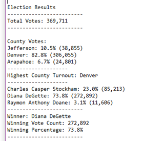
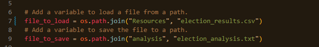

# Election-Analysis
 
## Overview of Election Audit
This is an analysis of election data for the Colorado Board of elections. Provided are county and candidate analysis using a python code on a .csv file provided by the client. Using this information we can determine the voting percentage for each county and candadit. 

## Election Audit Results
- Total Votes cast: 369,711

- Results by County:
    - **Arapahoe county** voters cast 24,801 votes, for a total of 6.7% of the total votes.
    - **Jefferson county** voters cast 38,855 votes, for a total of 10.5% of the total votes.
    - **Denver county** voters cast 306,055 votes, for a total of 82.8% of the total votes. 

    - **The county with the largest voter turn-out was Denver.**

- Results by Candidate:    
    - **Raymond Anythony Doane** recieved 11,606 votes, for a total of 3.1% of the total votes cast.
    - **Charles Casper Stockham** recieved 85,213 votes, for a total of 23.0% of the total votes cast. 
    - **Diana DeGette** recieved 272,892 votes, for a total of 73.8% of the total votes cast. 
    - **Diana DeGette was the winning candidate.**

    

## Election-Audit Summary
- The code used to this analysis can be applied to other election data. To use the this python code with with different data, the user will need to change the file path:

- If this data is used for elections that are in a national or state setting, the output lables would need to be updated to reflect the data set. For example: Highest County Turnout would need to be changed to Highest "State" or other label to reflect the data.  

